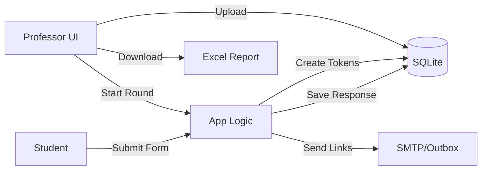

# Peer Evaluation Automation and Feedback Summary System

A lightweight, beginner-friendly Flask app to automate peer evaluations for team-based courses.
It sends unique evaluation forms to students, collects results, and generates a professor-friendly report with raw feedback, calculated scores, and optional summaries/red-flag detection.

---

## Quick Start (Local)

### 1) Prerequisites
- Python **3.10+** (3.11 recommended)
- Git (optional)

### 2) Get the code
```bash
# If you downloaded the zip, unzip it and cd into the folder
cd peer-eval
```

### 3) Create & activate a virtual environment
```bash
python -m venv .venv
# Windows
.venv\Scripts\activate
# macOS/Linux
source .venv/bin/activate
```

### 4) Install dependencies
```bash
pip install -r requirements.txt
```

### 5) Configure environment
Copy `.env.example` to `.env` and edit if needed:
```bash
cp .env.example .env
```
- For **development**, you can leave MAIL settings blank; emails will appear in **Dev Outbox** inside the app.
- Set `FLASK_SECRET_KEY` to a random value for security.
- Optionally set `OPENAI_API_KEY` for improved summaries.

### 6) Initialize database
```bash
python app.py  # this creates the SQLite db on first run and starts the server (Ctrl+C to stop)
```

### 7) Create an admin (professor) account
```bash
python app.py --init-admin
# Follow the prompts to create login credentials
```

### 8) Run the app
```bash
python app.py
```
Open your browser to **http://127.0.0.1:5000**

---

## Professor Workflow (Step-by-Step)

1. **Login** with the admin credentials you created 
   - username: admin@example.com
   - password: admin123
2. **Upload Students** (`Students → Upload`) using a CSV with columns: `first_name,last_name,email,team`.  
   - A sample is provided at `data/sample_students.csv`.
3. **Create or Upload a Rubric** (`Rubrics`).  
   - Create blank rubric and add items, or upload `data/sample_rubric.csv` with columns `criterion,weight,max_score` (optional: `description`).
4. **Start Evaluation Round** (`Start Round`).  
   - Choose a rubric and click **Generate & Send Forms**.
   - The system creates one **unique form per evaluatee**, and **sends links to each team member**. In development, links show up under **Outbox**.
5. **Students Complete Evaluations** by opening their unique links and submitting scores + comments.
6. **Download Report** (`Dashboard → Download Report`).  
   - Excel file includes:
     - `RawFeedback` — one row per evaluation
     - `Scores` — calculated averages per student
     - `Summaries` — optional NLP summary and keyword-based red-flag hints
7. **Close Round** to stop new submissions.
8. Red 'x' button to erase evaluation round from system.

---

## Email Delivery Options

- **Development**: Leave mail settings blank. All sent messages appear under **Outbox** in the app UI.
- **Production SMTP**: Set in `.env`:
  ```env
  MAIL_SERVER=smtp.yourhost.com
  MAIL_PORT=587
  MAIL_USERNAME=your_user
  MAIL_PASSWORD=your_pass
  MAIL_USE_TLS=True
  MAIL_DEFAULT_SENDER="Peer Eval <no-reply@yourdomain>"
  ```

Each evaluator receives a message that lists **one link per teammate** they need to evaluate (each link is a unique one-time token).

---

## Scoring Logic

- Each rubric item has a **weight** and **max_score**.
- For each evaluation, we compute a **weighted percentage**:
  \[ \text{score%} = 100 \times \frac{\sum_i (score_i / max_i)\cdot weight_i}{\sum_i weight_i} \]
- `Scores` sheet averages this across evaluators per student.

---

## NLP (Optional)

- **Summaries**: If `OPENAI_API_KEY` is set, the app uses OpenAI for succinct summaries.
  Otherwise it falls back to a simple frequency-based summarizer.
- **Red Flags**: A minimal keyword scan highlights potential concerns (e.g., harassment, cheating). This is **not** a definitive detector—professors should review raw comments.

---

## Security Notes

- Uses Flask-Login with hashed passwords (Werkzeug).
- Keep your `.env` and database private. Change the default secret key.
- For production, run behind HTTPS (e.g., with nginx + gunicorn) and use a real SMTP sender domain.

---

## CSV Templates

**Students**
```csv
first_name,last_name,email,team
Alex,Kim,alex.kim@example.edu,Team A
Blair,Lee,blair.lee@example.edu,Team A
...
```

**Rubric**
```csv
criterion,description,weight,max_score
Quality of Work,Completes tasks thoroughly and accurately,2,5
...
```

---

## Architecture

- **Flask** web app
- **SQLite** via SQLAlchemy
- **Email** via SMTP (or Outbox fallback)
- **Excel** reports via pandas + openpyxl
- **Optional** OpenAI summaries



---

## Test Drive (No Email Needed)

1. Start a round with students loaded.
2. Open **Outbox** and click/copy a link.
3. Submit a few evaluations.
4. Download the report and open it to see `RawFeedback`, `Scores`, and `Summaries`.